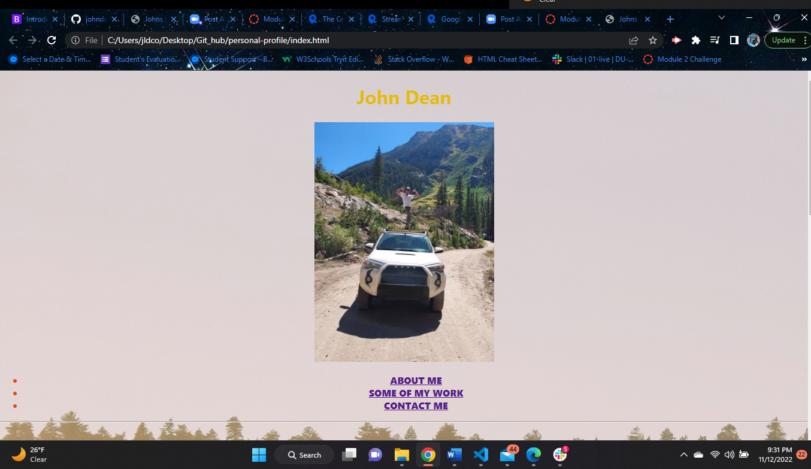

#Personal Profile.

##User Story

AS AN employer
I WANT to view a potential employee's deployed portfolio of work samples
SO THAT I can review samples of their work and assess whether they're a good candidate for an open position
Acceptance Criteria
Here are the critical requirements necessary to develop a portfolio that satisfies a typical hiring manager's needs:

GIVEN I need to sample a potential employee's previous work
WHEN I load their portfolio
THEN I am presented with the developer's name, a recent photo or avatar, and links to sections about them, their work, and how to contact them
WHEN I click one of the links in the navigation
THEN the UI scrolls to the corresponding section
WHEN I click on the link to the section about their work
THEN the UI scrolls to a section with titled images of the developer's applications
WHEN I am presented with the developer's first application
THEN that application's image should be larger in size than the others
WHEN I click on the images of the applications
THEN I am taken to that deployed application
WHEN I resize the page or view the site on various screens and devices
THEN I am presented with a responsive layout that adapts to my viewport

##Actual Behavior
You are brought to my profile page showing my name and a picture of me standing on my 4runner.
 There are 3 links to direct you to My about me, my work so far, and how to contact me. 
 when you click on one of any one of my screenshot of completed works it directs you to that application.
 The application is responsive to various screen layouts.

 * The URL of the GitHub repository, with a unique name and a readme describing the project.
 ### [@Link to Github]https://github.com/johndean3326/personal-profile

* The URL of the deployed application.
 ### [@Web page]https://johndean3326.github.io/personal-profile/
 
### 